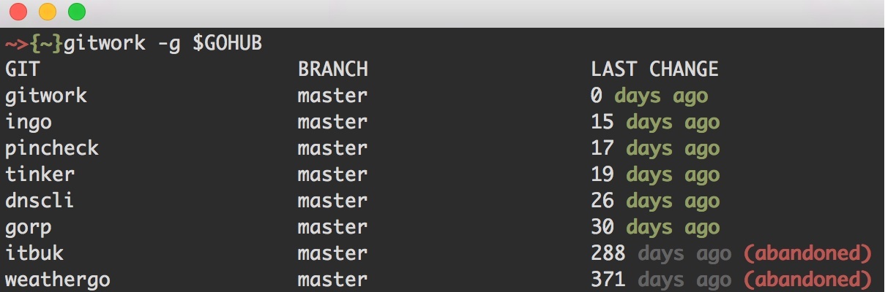

Gitwork
-------
An excuse to use the git2go API and track what repositories are the most used.

Depedencies
-----------
You need to install:

- [libgit2](https://github.com/libgit2/libgit2) 
- [git2go](https://github.com/libgit2/git2go) 
- [logrus](https://github.com/Sirupsen/logrus) 

Getting started
---------------
By default looks for the ```$GIT``` env var. If it's defined, points to the main
directory where you keep all your git repositories.

In case it's not found, you may provide a directory with the flag ```-g```.



In this example I provide an env var for all my Go projects.

Caveats
-------
There are some things to improve:

- The number of days whereby a repository is marked as abandoned is 90 days. This is harcoded, it could be easily move to an external config file.
- It reads the branch you are sitted on, it would be nice to provide a flag for a certain branch.
- If the number of days is zero, mark as active.
